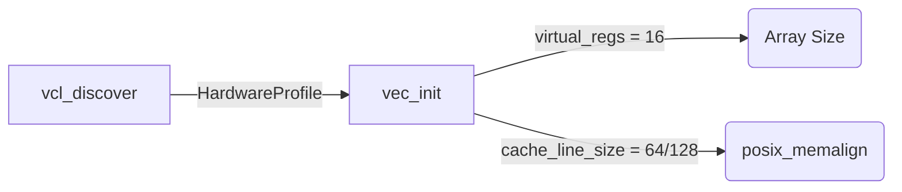

# VEC (Vector Execution Context) — Complete Technical Documentation

> **Source**: [`vec.h`](../include/vec.h) · [`vec.c`](../src/vec.c)
>
> Single source of truth for the Vector Execution Engine's memory layout,
> alignment proofs, safety limits, and architectural bounds.

---

## Table of Contents

1. [Overview](#1-overview)
2. [Architecture: The CPU of the Virtual Machine](#2-architecture)
3. [Memory Layout & Opaque Encapsulation](#3-memory-layout)
4. [Cache Alignment Proofs (VCL Integration)](#4-cache-alignment-proofs)
5. [The Dirty Mask & 16-bit Coupling Limits](#5-dirty-mask-limits)
6. [Fault Boundaries](#6-fault-boundaries)
7. [Tradeoff Summary Matrix](#7-tradeoff-matrix)

---

## 1. Overview

VEC is the core execution context for the LLFPL1 virtual machine. If the Registry
acts as RAM, VEC acts as the CPU. It allocates and manages the "virtual registers" — 
a software array of `double`s that the interpreter uses to perform all mathematical
operations.

### Core Responsibilities

- Allocate a contiguous array of virtual registers using OS-level memory alignment.
- Track execution cycles via a monotonic clock.
- Track state changes (which registers are modified) using a highly efficient bitmask.
- Completely hide these implementation details from the rest of the application.

---

## 2. Architecture: The CPU of the Virtual Machine

VEC receives a `HardwareProfile` from VCL during initialization. It uses this profile 
to size and align its internal arrays perfectly for the specific host machine it is 
running on.



By ensuring the virtual vector count exactly matches the C-compiler's expectations,
we allow the C-compiler to fuse these memory locations directly into the host CPU's 
physical registers during hot execution loops, avoiding cache spilling entirely.

---

## 3. Memory Layout & Opaque Encapsulation

### Struct Packing (Hidden in `vec.c`)

```
Offset  Size  Field            Type
──────  ────  ──────────────── ─────────
 0       8    r                double*
 8       8    clock            uint64_t
 16      2    reg_count        uint16_t
 18      2    dirty_mask       uint16_t
──────  ────
        20    TOTAL bytes (packed layout)
```

### Opaque Pointer Design

`VEC` is defined entirely inside `vec.c`. In `vec.h`, callers only see:

```c
typedef struct VEC VEC;
```

**Why?**
If a caller could see the struct, they could illegally modify `v->clock = 999;` or
corrupt the `v->r` pointer. By using an opaque pointer, the caller can only hold a 
reference to the execution engine. They must use strictly defined public functions 
to interact with it. 

---

## 4. Cache Alignment Proofs (VCL Integration)

### The Problem with `malloc`
Standard `malloc()` on most 64-bit systems aligns to 16 bytes. If an array of 
`double`s crosses a 64-byte or 128-byte hardware cache line boundary, the CPU has 
to perform *two* physical memory fetches to load a single virtual register, leading 
to "Cache Tearing" or "False Sharing."

### The Solution: `posix_memalign`
VEC uses `posix_memalign` paired with the exact `cache_line_size` proven by VCL.

```c
posix_memalign((void**)&v->r, profile.cache_line_size, sizeof(double) * v->reg_count)
```

**Mathematical Proof of Alignment**:
- VCL mathematically proves that `cache_line_size` is a power of two ≥ 8.
- `posix_memalign` guarantees the base address of `v->r` is an exact multiple of `cache_line_size`.
- Therefore, the start of the virtual register array perfectly aligns with the 
  physical start of an L1 data cache line.
- The array spans exactly `16 * 8 = 128` bytes. 
- On Intel (64-byte lines), it occupies exactly 2 cache lines. On Apple Silicon (128-byte lines), it occupies exactly 1 cache line.
- Zero cache tearing can ever occur.

---

## 5. The Dirty Mask & 16-bit Coupling Limits

VEC tracks modified registers using a bitmask:
```c
uint16_t dirty_mask;
```

**The 16-bit Math**:
A `uint16_t` has exactly 16 bits. Our VM normalizes to 16 virtual registers.
- Bit 0 = Register 0
- Bit 15 = Register 15

This is an incredibly fast, O(1) way to track state. However, it introduces a tight 
coupling constraint: `virtual_regs` cannot exceed 16.

**The Compile-Time Safety Guard**:
Inside `vec_init()`, there is an absolute runtime boundary check:
```c
if (profile.virtual_regs > 16) { return NULL; }
```
If VCL or a user modifies `DEFAULT_REGS` to be 32, this check will cleanly fail, 
preventing a silent bitmask overflow that would otherwise corrupt memory states.

---

## 6. Fault Boundaries

| Failure                       | Detection              | Behaviour                |
|-------------------------------|------------------------|--------------------------|
| Profile requests > 16 regs    | `profile.virtual_regs > 16` | Fails fast, returns `NULL` |
| `malloc` fails for struct     | `!v`                   | Fails fast, returns `NULL` |
| `posix_memalign` fails        | Return value `!= 0`    | Frees struct, returns `NULL` |

By safely returning `NULL` under memory exhaustion or illegal configuration limits, 
VEC prevents cascading crashes in the rest of the application.

---

## 7. Tradeoff Summary Matrix

| Decision                           | What We Gain                            | What We Accept                           |
|------------------------------------|-----------------------------------------|------------------------------------------|
| Opaque `VEC` struct                | Absolute state protection & immutability| Requires getter/setter functions later   |
| `uint16_t` for `dirty_mask`        | Minimal memory footprint (2 bytes)      | Hard cap at 16 virtual registers         |
| `posix_memalign` over `malloc`     | Zero cache-tearing, flawless alignment  | POSIX-specific, slightly slower alloc    |
| Returning `NULL` on alloc failure  | Safe, graceful degradation              | Caller must explicitly check for `NULL`  |
| Shrinking `reg_count` to `uint16_t`| Saves 2 bytes, struct fits perfectly    | Max limit of 65,535 registers            |
